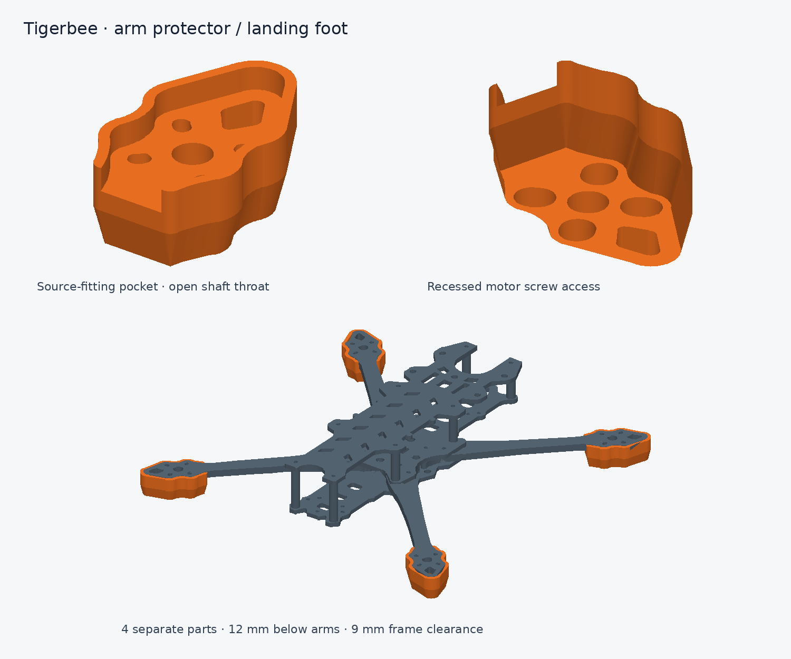
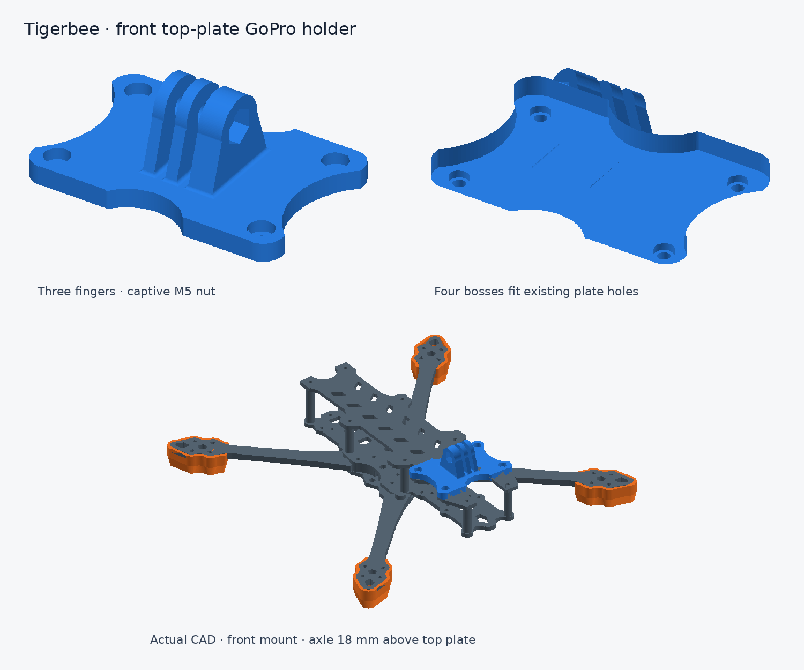

# Tigerbee CAD

Five independently buildable carbon components, four arm protector feet, a GoPro
holder and a symmetric 7-inch FPV frame assembly, in a locked Python 3.13 / uv project.

**Tigerbee.FCStd and the three supplied arm/camera 3MF files outrank the scans.**
The generated design preserves their foundation while correcting symmetry and
assembly interfaces. Scan_2 informs only the missing rear/top plates. Original
reference files and extracted profile data are preserved. `compare_a4` is not a
build step, geometry authority or acceptance gate.

| Component | Geometry | Thickness |
| --- | --- | --- |
| `arm-type-1` | FreeCAD foundation, front mirrored pair, local root relief | 5 mm |
| `arm-type-2` | FreeCAD foundation, rear mirrored pair, local root relief | 5 mm |
| `camera-plate` | Mirrored FreeCAD silhouette, tangent joins, nominal openings | 3 mm |
| `rear-plate` | Analytic symmetric silhouette and repeated features from Scan_2 | 3 mm |
| `top-plate` | Analytic symmetric silhouette, slots and matching support holes | 3 mm |

## Geometry and parameters

The user-specified diagonal wheelbase is **305 mm**. Motor centers form a square
X at (±107.833784131, ±107.833784131) mm, with perpendicular diagonals centered at
(0, 0). Front/rear arm rotations are 45°/135°; left copies are mirrored about X=0.
Motor pads and shaft geometry retain their saved CAD basis.
Root tips have a **0.6 mm left/right gap**, transverse root clearance and rounded
local electronics clearance notches. Rear bases follow the shared clamp outline
with a 0.2 mm inset and R0.3 tangent blends; the outward mounting pads and shafts
retain their original geometry. See the [root fit comparison](refs/analysis/arm-root-fit.svg).
Camera/rear clamp shoulders are locally
reinforced for the new shared hole positions. Nominal structural bores are **3.2 mm** for the modeled 3 mm shafts.

All plate mounting holes derive from one shared interface in
[src/tigerbee/layout.py](src/tigerbee/layout.py); independent tracing fits are no
longer used. [PlateDimensions](src/tigerbee/plates.py) controls repeated opening
sizes, pitches and radii. Camera features retain the 15 × 15 mm R2 square,
18.5 mm round opening and 11.5 × 8.5 mm R2.5 slots from the CAD foundation.
Plate contours use only lines and circular arcs, with tangent perimeter joins.
Export reports keep historical tracing assumptions in `reference_assumptions`;
`assumptions` and effective dimensions describe the current generated design.

Plate profiles use the assembly XY datum, X=0 as their symmetry axis, and lower
face Z=0. Arms use the motor shaft center X=Y=0, extending toward negative Y.
Python parameters are the editable parametric source. Generated FreeCAD documents
contain native solids and dimensional metadata, without a reconstructed sketch
constraint history. Individual JSON reports include nominal dimensions and hole
coordinates; derived decimals do not imply equivalent measurement accuracy.

## Build and inspect

```sh
uv sync --locked
uv run tigerbee build --all
uv run tigerbee assembly --require-fit
uv run tigerbee protectors
uv run tigerbee gopro-holder
uv run tigerbee native
uv run tigerbee verify-exports
```

The canonical [components](exports/parts/) and [assembly](exports/assembly/)
contain STEP, 3MF, STL, SVG and native FCStd files, plus component DXF, assembly
GLB and JSON reports. The [top view](exports/assembly/tigerbee-top.svg) and
[fit report](exports/assembly/assembly-report.json) describe the same geometry.
The [dimensioned motor layout](exports/assembly/tigerbee-motor-layout.svg) shows
the actual bore-center coordinates and both measured diagonals.
Every assembly export requires the actual-solid geometry audit to pass, including
when `--require-fit` is omitted. The explicit flag additionally enforces report
consistency. Native export saves and reopens every FCStd document; the final
inventory verifies source and output hashes.

Native conversion requires FreeCADCmd or the FreeCAD Flatpak. Normal component
and assembly builds do not import FreeCAD or the original reference document.
Regenerate all six build steps after source changes and commit their exports
together. CI checks freshness before rebuilding and applies strict fit validation.

```sh
# Custom parts go outside the canonical assembly output directory.
uv run tigerbee build arm-type-1 --thickness 5.5 --length-extension 10 --output build/custom
uv run tigerbee build camera-plate --center-hole-diameter 19 --output build/custom
# Historical photo thickness assumptions, with the current symmetric geometry.
uv run tigerbee build --all --preset product-7inch --output build/product-7inch
```

The default `frame` preset uses the confirmed 5 mm arms and 3 mm plates.
The explicitly selected `original` preset uses historical source **thicknesses**,
not original asymmetric geometry. `build_reference_profile` explicitly reconstructs the saved
profiles for independent historical regression tests. Custom standalone variants
are not automatically qualified as replacement parts in the default assembly.

## Arm protectors and standing feet



Four separately printable accessories follow the **current** motor pad outlines:
[type 1 right](exports/accessories/arm-type-1-protector-right.3mf),
[type 1 left](exports/accessories/arm-type-1-protector-left.3mf),
[type 2 right](exports/accessories/arm-type-2-protector-right.3mf),
[type 2 left](exports/accessories/arm-type-2-protector-left.3mf).
Type 1 is the front pair; type 2 is the rear pair. Print one of each.
Each has its own STEP, STL, 3MF, FCStd, SVG and parameter/fit report in
[exports/accessories](exports/accessories/). The optional
[assembled FreeCAD preview](exports/accessories/tigerbee-with-protectors.FCStd)
contains the original 15 frame solids plus four protectors; the original frame
assembly remains independently available.

The TPU design has a 0.25 mm radial pocket allowance, 2 mm bumper wall, 2 mm
mounting floor and a tapered flat foot extending 12 mm below the 5 mm arm.
This gives **9 mm ground clearance below the lower plate**. The rim stops 0.2 mm
below the carbon top so the motor sits directly on the carbon. All six source
openings remain open. The four motor slots have 0.2 mm extra clearance per side;
6.6 mm wide recessed channels accept screw heads and driver access from below.

Standalone files have the flat foot on Z=0; the arm underside seats at Z=12 mm.
The four existing motor screws retain each protector. The added grip length is
2 mm; select screw length from the actual motor's thread engagement and check
that the screws cannot reach its windings. No motor or screw solids are supplied.
Print a single TPU fit sample before the set: pocket clearance, screw heads and
material deformation need physical checking. The internal counterbore shoulders
may need localized support depending on printer and slicer; keep all access
channels clear. CAD geometry and print meshes are verified, not impact-tested.

```sh
uv run tigerbee protectors
# Custom landing height / print allowance, separate from canonical exports:
uv run tigerbee protectors --drop 15 --clearance 0.35 --output build/custom-protectors
```

[ProtectorParameters](src/tigerbee/protectors.py) exposes height, clearance,
wall and mounting-floor thickness. [Design and verification](tasks/arm-protectors.md)
records the scope and measurements. The geometry uses build123d's
[face offset and loft operations](https://build123d.readthedocs.io/en/stable/operations.html).

## Top-plate GoPro holder



The [separate holder](exports/accessories/top-plate-gopro-holder.3mf) sits on the
front top plate, above the FPV-camera region. Its four mounting axes come directly
from the current Ø5 mm carbon bores: X=±28 at Y=58 and X=±27 at Y=91 mm.
Four Ø4.8 × 2 mm locating bosses register in those holes; use four M3 bolts with
washers and nuts underneath. Ø3.3 bores and Ø6.6 counterbores provide clearance.
The 5 mm base leaves a 2 mm floor beneath the 3 mm deep counterbores. M3 screw
length must suit that floor, the 3 mm carbon, washer and nut engagement.

Three GoPro-style fingers receive the camera's two fingers. A transverse M5 bolt
controls pitch; a metal M5 hex nut fits the right-side captive seat (8.4 mm across
flats, 4.2 mm deep). The other fingers are 3 mm thick with 3.2 mm gaps, R7.5 crowns
and a Ø5.5 axle bore. These nominal dimensions follow
[the author's compatible interface drawing](https://jackw01.github.io/assets/projects/modularmounts-GoPro%20Profile.pdf),
not an official GoPro tolerance specification. A nominal two-finger coupon clears
the holder at 5° intervals from −15° to 60°. Exact GoPro-body and FPV-camera-body
clearances are not established because those bodies are absent from the source CAD.

The low version places the axle **18 mm above the top plate**, at frame
(0, 74.5, 56) mm. The height is adjustable from 18 to 30 mm. Print exports put the
boss tips at Z=0 and the base seating plane at Z=2; support is needed under the
raised base and horizontal bores, with support removed from all mating surfaces.
Confirm printed finger fit, nut seating and fastener engagement on a sample before
mounting a camera. Geometry validation does not establish material strength or
impact retention; no material-specific load qualification has been performed.

[STEP](exports/accessories/top-plate-gopro-holder.step),
[STL](exports/accessories/top-plate-gopro-holder.stl),
[FreeCAD](exports/accessories/top-plate-gopro-holder.FCStd) and
[SVG](exports/accessories/top-plate-gopro-holder.svg) are separate component files.
The [assembled FreeCAD preview](exports/accessories/tigerbee-with-gopro-holder.FCStd)
contains 20 solids: the frame, four protector feet and the holder. Its matching
STEP, GLB and side/isometric SVGs are in the same directory.

```sh
uv run tigerbee gopro-holder
uv run tigerbee gopro-holder --axle-height 28 --output build/raised-gopro
```

See [design and validation](tasks/gopro-holder.md) and the editable
[GoProParameters](src/tigerbee/gopro.py).

## Verification and physical scope

```sh
uv run pytest
uv run ruff check .
uv run ruff format --check .
uv run mypy src/tigerbee
uv build
```

Checks cover actual-solid reflection, coaxial through bores, shaft passage through
every intersected layer, opening counts, solid interference, minimum mounting
ligaments, root-base containment within both lower plate outlines, equal motor-bore
diagonals and nominal 7-inch propeller-disc gaps. Root transition tests also check
18 mm minimum width and preservation of the original shaft.
Tests also cover original FreeCAD baselines, dimensional variants, mesh topology
and exported STEP round trips. Inspect the current assembly report for measured
values and acceptance thresholds.

The assembly contains four arms, three plates and eight simplified standoffs.
All plate stock is confirmed at 3 mm, arms at 5 mm and standoff outside diameter
at 6 mm. The retained top underside Z=35 mm gives six 24 mm and two 32 mm
standoffs. Their modeled internal clearance is 3.2 mm. Bolt/nut
and camera/end-bracket solids are not modeled. Stock, layup, machining tolerances,
purchased hardware and physical fit/load tests remain necessary for a production
release; passing the geometry audit establishes nominal CAD fit.

See [reference authority](refs/SOURCES.md), [physical measurements](refs/measurements.md),
[design contract](tasks/plan.md) and [remaining tasks](tasks/todo.md).
