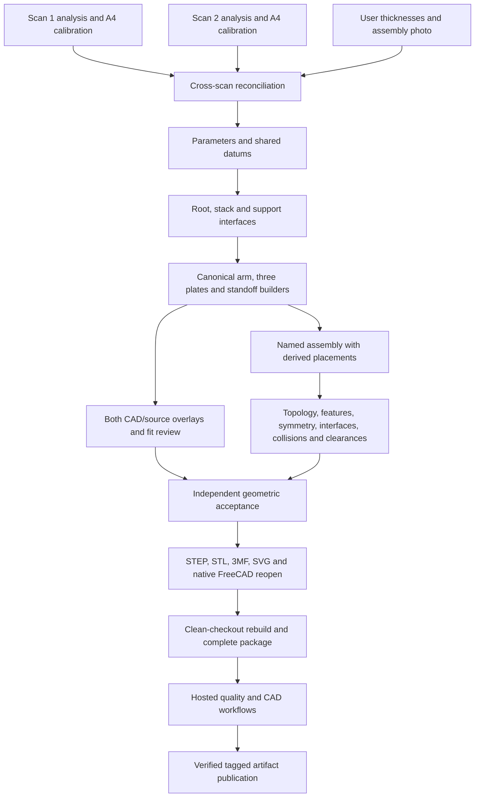

# Dependency backlog

- [x] Preserve originals; independent Scan1/Scan2 analysis and reconciliation.
- [x] A4 calibration, user5/2mm thickness and photo-derived plate ordering.
- [x] Immutable parameters, shared layout, canonical arm and3plate profiles.
- [x] Parametric contour deformation and actual source/CAD overlays.
- [x] Named15part assembly and BREP mechanical/clearance validation.
- [x] Configurable nominal FC/ESC/camera/stack-hardware envelopes.
- [x] STEP/STL/3MF/SVG/FCStd actual full-frame export and native reopen.
- [x] CLI build/validate/overlay/export/drawing and parameter metadata.
- [x] Required documentation, explicit reconstruction/physical assumptions.
- [x] Active parent CI/CAD/release workflows; complete inventory packager.
- [x] Independent geometric review; baseline193test clean suite and all5preset reports.
- [x] Finald09c1e8 clean rebuild:203tests, allcommands, completepackage, truthfulgitprovenance.
- [x] Finald09c1e8 hostedCI34780669616 and CAD34780669690 bothpass; downloadedchecksumsverified.
- [x] Full76-sectionPLAN audit; all implementation/review findings closed.
- [x] Userapproved v0.1.0 atd09c1e8; taggedworkflow34821227842 passed, publicrelease and allassets verified.

Keep inferred hardware and corrected root geometry explicit. No assertion of
physical stock/process strength or compatibility with unspecified equipment.

## Dependency graph

Geometry source changes invalidate overlays, mechanical gates and downstream
exports. Metadata-only changes require refreshed provenance; packaging changes
require package regressions and a new complete inventory check. Historical
handoffs preserve prior evidence, while current report hashes identify snapshots.
